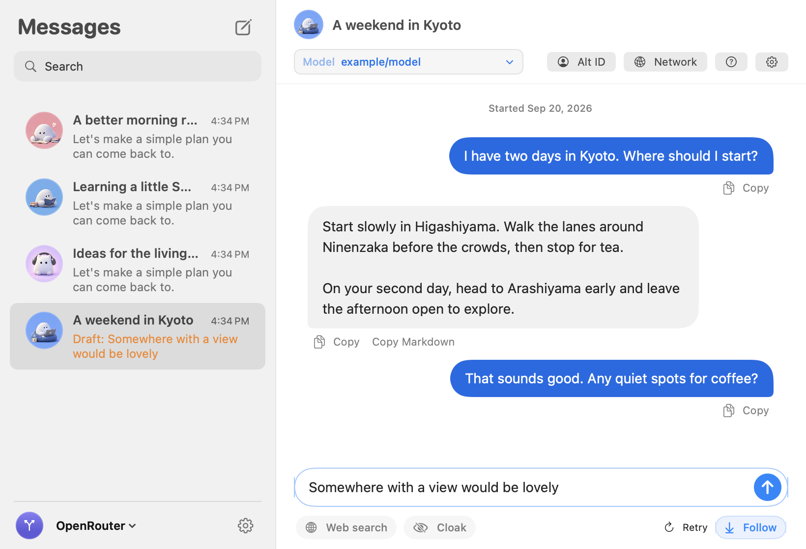

  <strong>Big ideas. Fewer personal details.</strong> 
  A beautiful home for your AI conversations. Cloak for the details you’d rather keep to yourself.

  <a href="https://concurred.ai/"><strong>Meet Concurred ↗</strong></a>
  &nbsp; · &nbsp;
  <a href="#cloak-on-share-less"><strong>Meet Cloak</strong></a>
  &nbsp; · &nbsp;
  <a href="#say-hello">Start chatting</a>
  &nbsp; · &nbsp;
  <a href="docs/GUIDE.md">Help & setup</a>

Plan a weekend. Untangle a thought. Get past the blank page.

Concurred brings the AI models you choose into a Mac app that feels as easy as sending a message. With **Cloak**, you can give personal details a stand-in before they reach the AI. Bring your question. Share a little less of yourself.

<picture>
  <source media="(prefers-color-scheme: dark)" srcset="docs/assets/chat-dark.png">
  
</picture>

Made for Mac. Lovely in light and dark. Shown with a sample conversation.

<table>
  <tr>
    <td width="33%" valign="top">
      
      <h3>Your question. Your terms.</h3>
      
Meet Cloak. Hide matching names, emails, and other personal details before you send. Preview what leaves your Mac.

    </td>
    <td width="33%" valign="top">
      
      <h3>Make yourself at home.</h3>
      
Familiar bubbles. Favorite conversations. A little face for every chat. Everything right where you expect it.

    </td>
    <td width="33%" valign="top">
      
      <h3>Find your kind of AI.</h3>
      
A writing partner. A coding helper. A fresh point of view. Choose your model and change it when you want.

    </td>
  </tr>
</table>

## Cloak on. Share less.

Get help with the email, the plan, the first draft. Give the names and personal details a little cover.

Save your real and alternate details in **Alt ID**, then turn on **Cloak**. It swaps matching text before it reaches the AI and restores recognized replacements in the reply.

> You write **“I’m Maya.”** The AI sees **“I’m Alex.”**
>
> When it says **“Hi Alex,”** you see **“Hi Maya.”**

**See it before you send it.** Open **Review Cloak** to check the outgoing text, hide extra details, and send when it looks right. The review’s suggestions are found on your Mac.

Your Cloak replacements apply to web searches, too.

Cloak can miss details. Review sensitive text before sending. Your saved chats keep the originals. [More about Cloak](docs/GUIDE.md#optional-web-search-and-cloak).

## Keep the good conversations going.

Pick up yesterday’s idea. Start something new. Your chats save on your Mac, ready when you come back.

Watch replies arrive. Stop anytime. Try another answer. Copy the bit you need and get on with your day.

**OrcaRouter · OpenRouter · Featherless · Concurred**

Your choice of provider. Your choice of model. One place to chat.

## A few thoughtful extras.

**Bring the web along.** Add search results to your question when you need more context. Web search uses a separately installed TinyFish tool.

**Make the connection yours.** Choose a User-Agent preset or set a provider proxy. Each device preset gets its own little animated send-off. [Network details](docs/GUIDE.md#optional-web-search-and-cloak).

**Keep the familiar comforts.** Keys in macOS Keychain. Chat history on your Mac. Alt ID opens without a password. [How your data is stored](docs/GUIDE.md#storage-and-errors).

## Say hello.

**Mac running macOS 14+ · Your own provider API key**

1. [Build Concurred](docs/GUIDE.md#run) and open it.
2. Add your API key in **Settings**.
3. Choose a provider and model. Send your first message.

Want to share less from the start? Save your details in **Alt ID** and switch on **Cloak** before sending.

Currently available as source code; building needs Xcode 16+. Model access and charges come from your provider.

  <strong>Something on your mind?</strong> 
  <a href="https://github.com/harshsaver/Concurred/issues">Tell us what would make Concurred better.</a>

